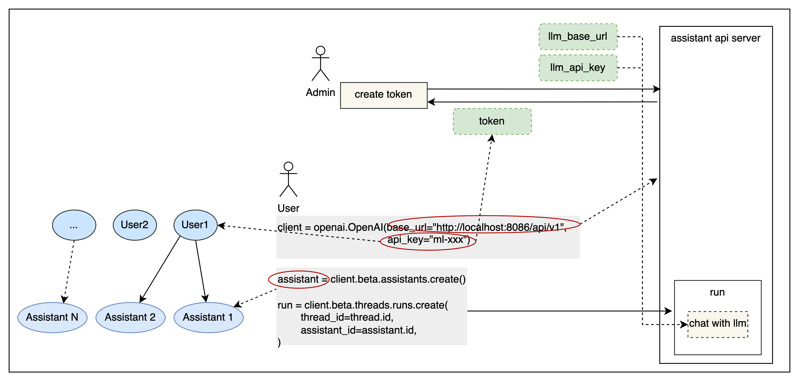

<div align="center">

# Open Assistant API

_✨ An out-of-the-box AI intelligent assistant API ✨_

</div>

<p align="center">
  <a href="./README.md">English</a> |
  <a href="./README_CN.md">简体中文</a>
</p>

## Introduction

Open Assistant API is an open-source, self-hosted AI intelligent assistant API, compatible with the official OpenAI
interface. It can be used directly with the official OpenAI [Client](https://github.com/openai/openai-python) to build
LLM applications.

It supports [One API](https://github.com/songquanpeng/one-api) for integration with more commercial and private models.

## Usage

Below is an example of using the official OpenAI Python `openai` library:

```python
import openai

client = openai.OpenAI(
    base_url="http://127.0.0.1:8086/api/v1",
    api_key="xxx"
)

assistant = client.beta.assistants.create(
    name="demo",
    instructions="You are a helpful assistant.",
    model="gpt-4-1106-preview"
)
```

## Why Choose Open Assistant API

| Feature                  | Open Assistant API    | OpenAI Assistant API |
|--------------------------|-----------------------|----------------------|
| Ecosystem Strategy       | Open Source           | Closed Source        |
| RAG Engine               | Simple Implementation | Supported            |
| Internet Search          | Supported             | Not Supported        |
| Custom Functions         | Supported             | Supported            |
| Built-in Tool            | Extendable            | Not Extendable       |
| Code Interpreter         | Under Development     | Supported            |
| LLM Support              | Supports More LLMs    | Only GPT             |
| Message Streaming Output | Supports              | Not Supported        |
| Local Deployment         | Supported             | Not Supported        |

- **LLM Support**: Compared to the official OpenAI version, more models can be supported by integrating with One API.
- **Tool**: Currently supports online search; can easily expand more tools.
- **RAG Engine**: The currently supported file types are txt, pdf, html, markdown. We provide a preliminary
  implementation.
- **Message Streaming Output**: Support message streaming output for a smoother user experience.
- **Ecosystem Strategy**: Open source, you can deploy the service locally and expand the existing features.

## Quick Start

The easiest way to start the Open Assistant API is to run the docker-compose.yml file. Make sure Docker and Docker
Compose are installed on your machine before running.

### Configuration

Go to the project root directory, open `docker-compose.yml`, fill in the openai api_key and bing search key (optional).

```sh
# openai api_key (supports OneAPI api_key)
OPENAI_API_KEY=<openai_api_key>

# bing search key (optional)
BING_SUBSCRIPTION_KEY=<bing_subscription_key>
```

### Run

#### Run with Docker Compose:

 ```sh
docker compose up -d
 ```

### Access API

Api Base URL: http://127.0.0.1:8086/api/v1

Interface documentation address: http://127.0.0.1:8086/docs

### Complete Usage Example

In this example, an AI assistant is created and run using the official OpenAI client library, including two built-in
tools, web_search and retrieval, and a custom function.
Before running, you need to run `pip install openai` to install the Python `openai` library.

```sh
# !pip install openai
python tests/e2e/index.py
```

### Permissions
Simple user isolation is provided based on tokens to meet SaaS deployment requirements. It can be enabled by configuring `APP_AUTH_ENABLE`.



1. The authentication method is Bearer token. You can include `Authorization: Bearer ***` in the header for authentication.
2. Token management is described in the token section of the API documentation. Relevant APIs need to be authenticated with an admin token, which is configured as `APP_AUTH_ADMIN_TOKEN` and defaults to "admin".
3. When creating a token, you need to provide the base URL and API key of the large model. The created assistant will use the corresponding configuration to access the large model.

## Community and Support

- Join the [Slack](https://join.slack.com/t/openassistant-qbu7007/shared_invite/zt-29t8j9y12-9og5KZL6GagXTEvbEDf6UQ)
  channel to see new releases, discuss issues, and participate in community interactions.
- Join the [Discord](https://discord.gg/VfBruz4B) channel to interact with other community members.
- Join the WeChat group:

  

## Special Thanks

We mainly referred to and relied on the following projects:

- [OpenOpenAI](https://github.com/transitive-bullshit/OpenOpenAI): Assistant API implemented in Node
- [One API](https://github.com/songquanpeng/one-api): Multi-model management tool
- [OpenAI-Python](https://github.com/openai/openai-python): OpenAI Python Client
- [OpenAI API](https://github.com/openai/openai-openapi): OpenAI interface definition
- [LangChain](https://github.com/langchain-ai/langchain): LLM application development library
- [OpenGPTs](https://github.com/langchain-ai/opengpts): LangChain GPTs

## Contributing

Please read our [contribution document](./docs/CONTRIBUTING.md) to learn how to contribute.

## Open Source License

This repository follows the MIT open source license. For more information, please see the [LICENSE](./LICENSE) file.
